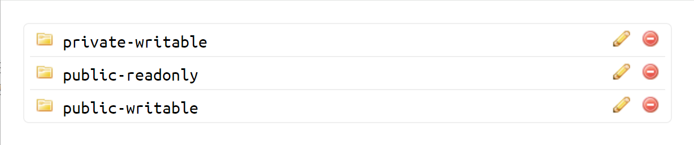

# GoWebdav

> Share local files with WebDAV, lightweight and very easy to use.

English | [中文](./README_zh_CN.md)

## feature

- Based on Golang implementation, high performance

- Finally compiled into a single binary file, no need for Apache and other environments, more stable

- Support browser access

- Multiple WebDAV services can be enabled under the same port, each with a different mount directory, user name, and password

- Docker is well supported

## quickstart

### bin

Go to <https://github.com/117503445/GoWebDAV/releases> to download the latest binaries.

Then run `. /gowebdav`

GoWebDAV will automatically create the example file under the `./data` path with the following file structure

```sh
> tree ./data
./data
├── public-writable
│ └── 1.txt
├── public-readonly
│ └── 2.txt
└── private-writable
    └── 3.txt
```

Visit <http://localhost:80> with your browser and you will see 3 different GoWebDAV services.



where <http://localhost:80/public-writable> is the `public-writable` service that maps the local `./data/public-writable` folder. It is Anonymizable and writable. You can view the contents of the file in the browser, as well as perform operations such as uploading and deleting.


<http://localhost:80/public-readonly> is the `public-readonly` service that maps the local `./data/public-readonly` folder. It is Anonymizable and read-only. You can view the contents of the file in your browser, but you cannot upload, delete, etc.


<http://localhost:80/private-writable> is the `private-writable` service that maps the local `./data/private-writable` folder. It is user-authenticated and writable. After logging in with `user1` and `pass1`, you can view the contents of the files in the browser, as well as upload, delete, etc.


The `dav` parameter can also be specified to configure the local path, user authentication, read-only, etc. properties of the WebDAV service, as described in the *Configuration Strings Description* section. When `dav` is not specified, the default `dav` parameter used by GoWebDAV is `/public-writable,./data/public-writable,null,null,false;/public-readonly,./data/public-readonly,null,null,true;/private-writable,./data/private-writable,user1,pass1,false`.

### Docker

The local file paths to be shared are `/root/dir1` and `/root/dir2`.

```sh
docker run -it --name go_webdav -d -v /root/dir1:/root/dir1 -v /root/dir2:/root/dir2 -e dav="/dav1,/root/dir1,user1,pass1,true;/dav2,/root/dir2,null,null,false" -p 80:80 --restart=unless-stopped 117503445/go_webdav
```

```sh
-e dav="/dav1,/root/dir1,user1,pass1,true;/dav2,/root/dir2,null,null,false"
```

Indicates passing a configuration string into the Docker image.

Then open <http://localhost/dav1> and <http://localhost/dav2> in the browser or webdav client like [raidrive](https://www.raidrive.com/).

## Configuration String

You can pass the `--dav` parameter to change the configuration.

On Windows, the same call as quickstart is made as follows

```
// cmd
gowebdav_windows_amd64.exe --dav "/public-writable,./data/public-writable,null,null,false;/public-readonly,./data/public-readonly,null,null,true;/private-writable,./data/private-writable,user1,pass1,false"

// PowerShell
.\gowebdav_windows_amd64.exe --dav "/public-writable,./data/public-writable,null,null,false;/public-readonly,./data/public-readonly,null,null,true;/private-writable,./data/private-writable,user1,pass1,false"
```

On Windows, the same call as quickstart is made as follows

```sh
./gowebdav_linux_amd64 --dav "/public-writable,./data/public-writable,null,null,false;/public-readonly,./data/public-readonly,null,null,true;/private-writable,./data/private-writable,user1,pass1,false"
```

The following is a specific explanation of `dav`

Use a semicolon to separate each WebDAV service configuration, which means that `"/dav1,/root/dir1,user1,pass1,true;/dav2,/root/dir2,null,null,false"` describes 2 services, which are

> /dav1,/root/dir1,user1,pass1,false

and

> /dav2,/root/dir2,null,null,true

The first service will mount the `/root/dir1` directory of the Docker image under `/dav1`. The required username and password for access are `user1` and `pass1` respectively.

Then, according to the previous `-v /root/dir1:/root/dir1`, the mapping relationship with `/root/dir1` of the physical machine can be completed and accessed.

The fifth parameter `false` indicates that this is a non-read-only service that supports addition, deletion, modification and query.

The second service will mount the `/root/dir2` directory of the Docker image under `/dav2`. The user name and password required for access are `null` and `null` respectively. At this time, it means that the service can be accessed without a password. .

Then according to the previous `-v /root/dir2:/root/dir2`, you can complete the mapping relationship with `/root/dir2` of the physical machine and access it.

The fifth parameter `true` indicates that this is a read-only service, only supports GET, does not support additions, deletions and modifications.

This method is recommended for file sharing without confidentiality requirements.

You can pass in the `--port` parameter to change the port to listen on. The default listens on port 80.

You can pass in the `--addr` parameter to change the address to listen on. The default listens on `0.0.0.0`.

```sh
# Listening on port 8080
./gowebdav_linux_amd64 --port 8080
```

## Docker Compose

Expose `/root/dir1`, which requires authentication, and `/root/dir2`, which does not require authentication.

```yaml
version: "3.9"
services:
  go_webdav:
    volumes:
      - "/root/dir1:/root/dir1"
      - "/root/dir2:/root/dir2"
    environment:
      - "dav=/dav1,/root/dir1,user1,pass1,true;/dav2,/root/dir2,null,null,false"
    ports:
      - "80:80"
    restart: unless-stopped
    image: 117503445/go_webdav
```

## Background introduction

`GoWebdav` is used to build a WebDAV-based file sharing server.

### Reasons to use WebDAV

1. Samba is inconvenient to use on Windows clients, and it is difficult to use non-default ports.

2. FTP mount trouble.

3. NextCloud is too heavy and difficult to share files on the server.

Because I didn't see a server-side implementation that could meet the above features, this project recreated a WebDAV Server.

## Local debugging

Rename `config.yml.example` to `config.yml`, configure in `config.yml` file

`go run .`

## Local Docker build

Using a layered build, the executable app is built through `go build` in the build layer, and then run in the prod layer. If you need to modify the structure of the configuration file later, you will also need to modify the Dockerfile.

````sh
docker build -t 117503445/go_webdav .
docker run --name go_webdav -d -v ${PWD}/TestDir1:/root/TestDir1 -v ${PWD}/TestDir2:/root/TestDir2 -e dav="/dav1,/root/TestDir1,user1,pass1,false;/dav2,/root/TestDir2,user2,pass2,true" -p 80:80 --restart=unless-stopped 117503445/go_webdav
````

## Safety

HTTP Basic Auth is used for authentication, and the account password is sent in clear text, which has no security at all. If important files or passwords are involved, be sure to use a gateway such as Nginx or Traefik to provide HTTPS.

## Acknowledgments

<https://github.com/dom111/webdav-js> provides front-end support
