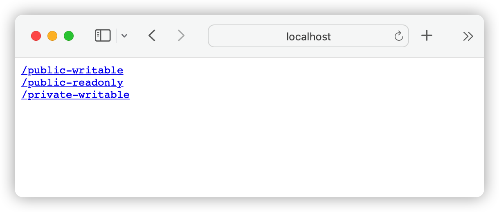
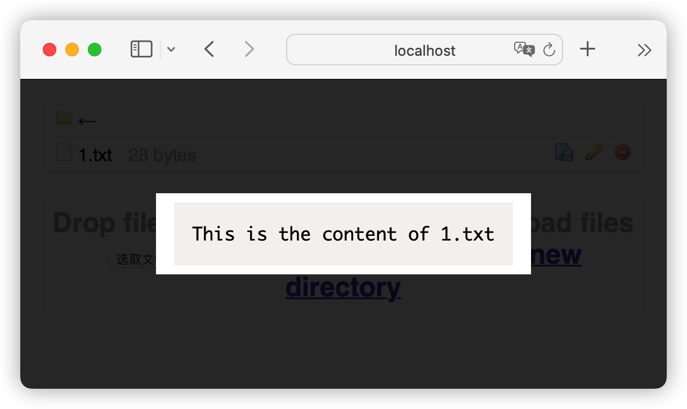
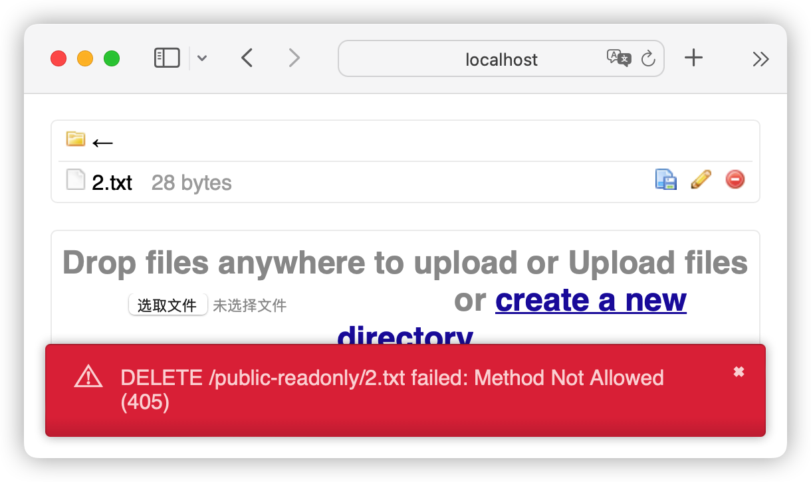
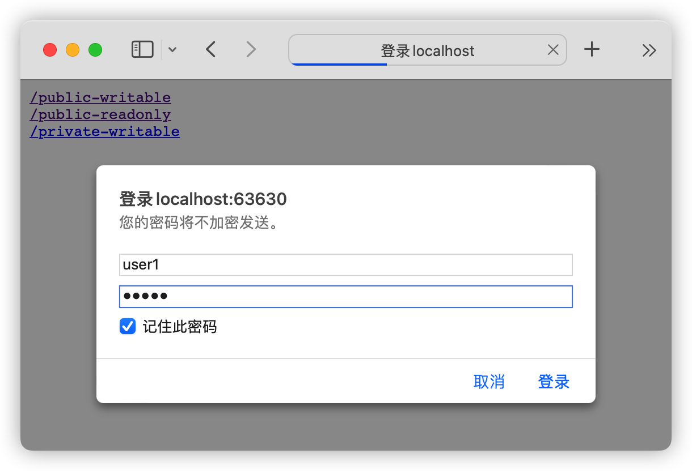

# GoWebdav

> 使用 WebDAV 分享本地文件，轻量级的、易于使用的

## 特性

- 基于 Golang 实现，性能高。

- 最终编译为单二进制文件，不需要 Apache 等环境，更加稳定。

- 支持浏览器访问。

- 可以在同个端口下启用多个 WebDAV 服务，各自有不同的挂载目录、用户名、密码。

- Docker 支持良好。

## 快速开始

### bin

去 <https://github.com/117503445/GoWebDAV/releases> 下载最新的二进制文件

然后运行 `./gowebdav`

GoWebDAV 会自动在 `./data` 路径下创建示例文件，文件结构如下

```sh
> tree ./data
./data
├── public-writable
│   └── 1.txt
├── public-readonly
│   └── 2.txt
└── private-writable
    └── 3.txt
```

使用浏览器访问 <http://localhost:80>，就可以看到 3 个不同的 GoWebDAV 服务了。



其中 <http://localhost:80/public-writable> 是 `public-writable` 服务，映射了本地的 `./data/public-writable` 文件夹。它是无用户验证的、可写的。可以在浏览器中查看文件内容，也可以进行上传、删除等操作。



<http://localhost:80/public-readonly> 是 `public-readonly` 服务，映射了本地的 `./data/public-readonly` 文件夹。它是无用户验证的、只读的。可以在浏览器中查看文件内容，但不可以进行上传、删除等操作。



<http://localhost:80/private-writable> 是 `private-writable` 服务，映射了本地的 `./data/private-writable` 文件夹。它是有用户验证的、可写的。在使用 `user1` 和 `pass1` 登录以后，可以在浏览器中查看文件内容，也可以进行上传、删除等操作。



也可以指定 `dav` 参数来配置 WebDAV 服务的本地路径、用户验证、是否只读等属性，详情见 *配置字符串说明* 章节。在不指定 `dav` 时，GoWebDAV 使用的默认 `dav` 参数是 `/public-writable,./data/public-writable,null,null,false;/public-readonly,./data/public-readonly,null,null,true;/private-writable,./data/private-writable,user1,pass1,false`。

### Docker

准备分享的本地文件路径为 `/root/dir1` 和 `/root/dir2`。

```sh
docker run -it --name go_webdav -d -v /root/dir1:/root/dir1 -v /root/dir2:/root/dir2 -e dav="/dav1,/root/dir1,user1,pass1,true;/dav2,/root/dir2,null,null,false" -p 80:80 --restart=unless-stopped 117503445/go_webdav
```

其中

```sh
-e dav="/dav1,/root/dir1,user1,pass1,true;/dav2,/root/dir2,null,null,false"
```

表示将配置字符串传入 Docker 镜像。

然后在浏览器中打开 <http://localhost/dav1> 和 <http://localhost/dav2>，就能正常以 WebDAV 的形式 访问磁盘文件了。

## 配置字符串说明

可以传入 `--dav` 参数，更改配置。

在 Windows 上，与 quickstart 相同的调用如下

```
// cmd
gowebdav_windows_amd64.exe --dav "/public-writable,./data/public-writable,null,null,false;/public-readonly,./data/public-readonly,null,null,true;/private-writable,./data/private-writable,user1,pass1,false"

// PowerShell
.\gowebdav_windows_amd64.exe --dav "/public-writable,./data/public-writable,null,null,false;/public-readonly,./data/public-readonly,null,null,true;/private-writable,./data/private-writable,user1,pass1,false"
```

在 Linux 上，与 quickstart 相同的调用如下

```sh
./gowebdav_linux_amd64 --dav "/public-writable,./data/public-writable,null,null,false;/public-readonly,./data/public-readonly,null,null,true;/private-writable,./data/private-writable,user1,pass1,false"
```

以下为 `dav` 的具体解释

使用分号将每个 WebDAV 服务配置分隔，也就是说 `"/dav1,/root/dir1,user1,pass1,true;/dav2,/root/dir2,null,null,false"` 描述了 2 个服务，分别是

> /dav1,/root/dir1,user1,pass1,false

和

> /dav2,/root/dir2,null,null,true

第一个服务会在 `/dav1` 下挂载 Docker 镜像的 `/root/dir1` 目录，访问需要的用户名和密码分别为 `user1` 和 `pass1` 。

再根据前面的 `-v /root/dir1:/root/dir1` 就可以和物理机的 `/root/dir1` 完成映射关系，进行访问了。

第 5 个参数 `false` 表示这是个非只读的服务，支持 增删改查。

第二个服务会在 `/dav2` 下挂载 Docker 镜像的 `/root/dir2` 目录，访问需要的用户名和密码分别为 `null` 和 `null`，这时候表示不需要密码就可以访问这个服务了。

再根据前面的 `-v /root/dir2:/root/dir2` 就可以和物理机的 `/root/dir2` 完成映射关系，进行访问了。

第 5 个参数 `true` 表示这是个只读的服务，只支持 GET，不支持 增删改。

对于无保密性要求的文件分享，建议使用这种方式。

可以传入 `--port` 参数，更改监听的端口。默认监听 80 端口。

```sh
# 监听 8080 端口
./gowebdav_linux_amd64 --port 8080
```

## Docker Compose

暴露需要认证的 `/root/dir1` 和 不需认证的 `/root/dir2`

```yaml
version: "3.9"
services:
  go_webdav:
    volumes:
      - "/root/dir1:/root/dir1"
      - "/root/dir2:/root/dir2"
    environment:
      - "dav=/dav1,/root/dir1,user1,pass1,true;/dav2,/root/dir2,null,null,false"
    ports:
      - "80:80"
    restart: unless-stopped
    image: 117503445/go_webdav
```

## 背景介绍

`GoWebdav` 用于搭建基于 WebDAV 的文件共享服务器。

### 使用 WebDAV 的原因

1. Samba 在 Windows 的客户端上使用不方便，难以使用非默认端口。

2. FTP 挂载麻烦。

3. NextCloud 太重了，而且难以实现 共享出来服务器上的文件。

因为没看到能满足上述特性的服务端实现，本项目再造了一个 WebDAV Server 轮子。

## 本地调试

把 `config.yml.example` 重命名为 `config.yml`， 在 `config.yml` 文件中修改配置

`go run .`

## 本地 Docker 构建

使用了分层构建，在 build 层 通过 `go build` 构筑了 可执行文件 app，再在 prod 层 进行运行。如果以后需要修改配置文件的结构，也需要修改 Dockerfile。

```sh
docker build -t 117503445/go_webdav .
docker run --name go_webdav -d -v ${PWD}/TestDir1:/root/TestDir1 -v ${PWD}/TestDir2:/root/TestDir2 -e dav="/dav1,/root/TestDir1,user1,pass1,false;/dav2,/root/TestDir2,user2,pass2,true" -p 80:80 --restart=unless-stopped 117503445/go_webdav
```

## 安全性

使用 HTTP Basic Auth 进行验证，账号密码明文发送，毫无安全性可言。如果涉及重要文件、重要密码，请务必用 Nginx 或 Traefik 等网关套一层 HTTPS 。

## 致谢

<https://github.com/dom111/webdav-js> 提供了前端支持
